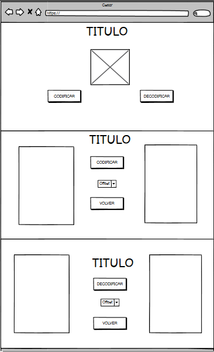
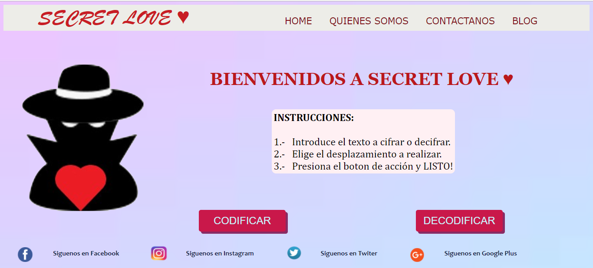
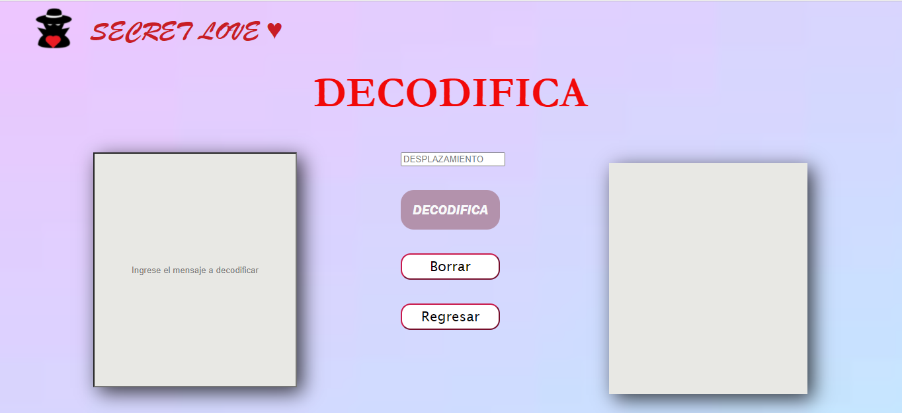

# SECRET LOVE 😍💋

## Índice

* [1. Resumen del Proyecto](#1-resumen-del-proyecto)
* [2. Prototipo en Balsamiq](#2-prototipo-en-balsamiq)
* [3. Imagen del Proyecto final](#3-imagen-del-proyecto-final)
* [4. Investigacion UX](#4-investigacion-ux)
* [5. Plan de accion](#5-plan-de-accion)

***

## 1. Resumen del Proyecto

Secret Love es una pagina web para parejas 💑 en donde se puede cifrar o descifrar mensajeria con cualquier desplazamiento de una forma segura en donde nadie más que la persona que recibe el mensaje y el numero de desplazamiento podrá saber lo que contiene el mensaje.

## 2. Prototipo en Balsamiq

## 3. Imágen del proyecto final

## 4. Investigación UX

#### Quienes son los principales usuarios del producto
Los principales usuarios son las parejas que desean mensajearse con textos cifrados para que solo ellos a través del desplazamiento puedan saber cuál es el mensaje.

#### Solucion del problema
El problema radicaba en que algunas parejas deseaban mensajearse sin que nadie más que solo ellos supieran cual era ese mensaje. Es así como surgió la idea de Secret Love, una página en la que ellos podrán mensajearse y este mensaje estará cifrado para que solo ellos puedan saber lo que contiene. 🥰

## 5. Plan de acción

* Instalar Visual Studio Code, Git y Node.js.
* Realizar un fork del repositorio de Laboratoria y luego clonarla para hacer una copia local.
* Hacer el prototipo de como quedaría mi página web a través de Balsamiq.
* A través de HTML hacer mi esctructura de las paginas que tendra.
* A través de index.js realizar las interacciones del DOM usando addEventListener para mostrar y ocultar las diferentes pantallas.
* A través de cipher.js realizar todo lo relacionado a la funcionalidad de codificar y decodificar con "code" y "decode", usando los métodos charCodeAt() para obtener el código Ascii y el método String.fromCharCode() para convertir en string el código Ascii previamente sumado o restado con el número de desplazamiento.
* Con el Hack Edition lograr que cifre y descifre no solo las mayúsculas si no tambien las minúsculas y espacios así como también los simbolos.
